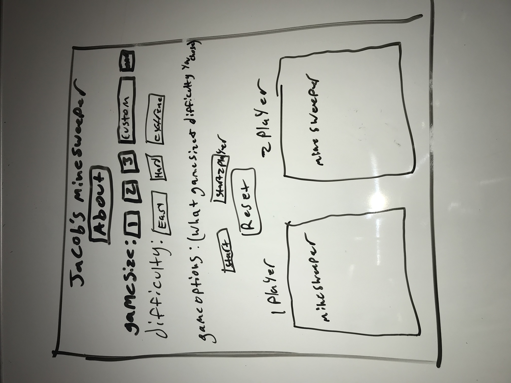

# Jacob-s_MineSweeper
First project for General Assembly
---

[Play My Game](https://jpcutshall.github.io/Jacob-s_MineSweeper/)

## About
  I chose to recreate mineSweeper because I wanted to be challenged and learn something new. It was a lot more challenging than I thought, but I am glad to have gotten it working correctly! My original intent was to make it Two player with two different games going on at once. The players would take turns playing their box (would be very slow game with the current setup). Got single player working almost like the original.

### setup
  - two Objects App and eventListeners
    - App contains game functions and data associated with the games
    - eventListeners just holds callback functions for my events
    - Really think The game needs to be setup with a class but I cant think of how to do it
  - when start button is pressed 'App.createGrid()'
    - creates a shuffled Array of '$(div)' with class of mines shuffled in and event Listener for both clicks
    - appends them to the game box divs
    - applies number values to squares with x amount of mines nearby
  - clicking on a square adds class checked and checks if it is a mine for game over condition
    - if its not a mine or square near mine its starts checking nearby for blank squares and checks(shows) them
    - every time flag is placed win condition is checked because having the flags on the same unchecked squares as a mine equals a win
  - Reset button will reset everything to its default value - how to page looks when it loaded

### Biggest Issues
1. Checking nearby squares if mine and adding how many are around - took me a couple days and is not very readable
2. When player 2 Board was created it would get mine positions from player 1 board and player 2 board(wrong mine counts) - stopped working on player 2 here(problem with tile or grid value inside App.createNewGrid)
3. Never got css(div and box) sizing down for custom game size - need more css practice

### future Features
  1. I want to get player 2 working
  2. game timer - only for player 1 game as with 2 players taking turns time will be worse
  3. custom game size - current is 20x20

## User Story
1. User clicks How To Play Button Which pops up a modal with the rules to playing
2. User clicks on which difficulty they want which changes the amount of mines
3. User Clicks 1 Player Start or Two player Start to begin one or two games (one player only right now) - supposed to take turns clicking on there game grid
4. User left clicks on game box to reveal mine or mines nearby or no mine
5. User Right Clicks or ctrl Left Clicks on hidden box to flag it (flags have to be on same box as mines to win)
6. User clicks reset to reset the site to how it originally was

---
## WireFrame

